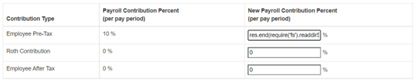
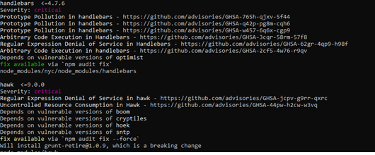

# Raport podatności znalezionych w aplikacji Node Goat

| Testowany system | Node Goat |
|:------: | :-----------: |
| Data wykonania | XII 2022 - I 2023 |
|  Miejsce wykonania audytu    | Kraków |
| Audytorzy wykonujący prace | Aleks Prochal, Michał Serwaczak, Jakub Sosin |
|  Wersja raportu    | 1.0 |

# 1.	Podsumowanie
Audyt aplikacji NodeGoat został zrealizowany w celu ustalenia zgodności ze standardem OWASP TOP 10. 
Stan zgodności aplikacji NodeGoat z OWASP Top 10 można uznać jako zły. W aplikacji znajduje się większość z dziesięciu najpopularniejszych błędów spotykanych w aplikacjach webowych.

# 2.	Zakres i cele
## 2.1 Cel
Celem audytu była wstępna weryfikacja spełniania przez aplikację standardu OWASP TOP 10, jest to dziesięć najpopularniejszych błędów spotykanych w aplikacjach webowych.

## 2.2	Wykonane czynności
W ramach audytu wykonano następujące czynności:
* Analiza błędów występujących w aplikacji
*	Rozmowy z deweloperami

## 2.3	Aplikacja NodeGoat
Aplikacja NodeGoat jest aplikacją webową, opartą o architekturę klient-serwer. Wykorzystuje m. in. Następujące technologie:
* Serwer HTTP
* MongoDB
* NodeJS

# 3. Znalezione podatności pod względem poziomu niebezpieczeństwa

# 4. Znalezione podatności

| $\color{grey}{\textrm{Nie stwierdzono}}$ |$\color{green}{\textrm{Niski}}$| $\color{yellow}{\textrm{Średni}}$ |$\color{red}{\textrm{Wysoki}}$|
|-|-|-|-|

| Numer | Opis |
| :------: | ----------- |
| A01:2021 Broken Access Control| <ul><li>$\color{red}{\textrm{Aplikacja wykorzystuje userid jako część adresu URL}}$</li><li>$\color{red}{\textrm{Możliwość dostępu do zasobów bez posiadania odpowiednich uprawnień}}$</li></ul> |
| A02:2021 Cryptographic Failures| <ul><li>$\color{red}{\textrm{Aplikacja wykorzystuje protokół HTTP do komunikacji z serwerem.}}$</li><li>$\color{red}{\textrm{Aplikacja przechowuje wrażliwe dane osobiste użytkownika jako zwykły tekst, bez używania jakiegokolwiek szyfrowania.}}$</li>
| A03:2021 Injection| <ul><li>$\color{red}{\textrm{Możliwość wstrzyknięcia kodu JS}}$</li><li>$\color{red}{\textrm{Podatności XSS}}$</li>
| A04:2021 Insecure Design| <ul> <li>$\color{grey}{\textrm{Na razie nie stwierdzono}}$</li>
| A05:2021 Security Misconfiguration| <ul> <li>$\color{green}{\textrm{Domyślny nagłówek HTTP x-powered-by może ujawnić szczegóły implementacji atakującemu}}$</li>|
| A06:2021 Vulnerable and Outdated Components| <ul> <li>$\color{yellow}{\textrm{Wykorzystywane są przestarzałe wersje bibliotek, oraz instalowane takie, które nie są używane}}$</li> 
| A07:2021 Identification and Authentication Failures| <ul> <li>$\color{red}{\textrm{Hasło zapisane w bazie danych w postaci zwykłego tekstu}}$</li><li>$\color{red}{\textrm{Sesja pozostaje aktywna do momentu, gdy użytkownik jawnie się wyloguje}}$</li><li>$\color{yellow}{\textrm{Aplikacja nie wymusza silnego hasła}}$</li><li>$\color{green}{\textrm{Aplikacja precyzuje czy błędne jest hasło czy login}}$</li>
| A08:2021 Software and Data Integrity Failures| <ul> <li>$\color{grey}{\textrm{ Na razie nie stwierdzono }}$</li>
| A09:2021 Security Logging and Monitoring Failures| <ul> <li>$\color{yellow}{\textrm{Brak jakiegokolwiek logowania i monitoringu}}$</li>
| A10:2021 Server-Side Request Forgery (SSRF)| <ul> <li>$\color{red}{\textrm{Atakujący może zmienić parametry URL żeby wskazać na kontrolowaną przez siebie stronę internetową, aby wejść w interakcję z serwerem }}$</li>

# 5. Szczegóły
## A01:2021 Broken Access Control
Kategoria podatności opisująca błędy dostępu. Kontrola dostępu egzekwuje politykę w taki sposób, aby użytkownicy nie mogli działać poza swoimi zamierzonymi uprawnieniami. Nieprawidłowości prowadzą zazwyczaj do nieuprawnionego ujawnienia informacji, modyfikacji lub zniszczenia wszystkich danych.
|||
|:------: | ----------- |
| Opis podatności | ***Insecure Direct Object References***   Aplikacja NodeGoat używa `userid` jako części adresu `URL`, oraz nie sprawdza czy użytkownik jest uprawniony do przeglądania strony docelowej. Widoczne jest to w module Allocations. Napastnik jest w stanie zmodyfikować adres `URL` i uzyskać informacje o alokacjach innych użytkowników. |
| Zrzuty ekranowe |W `routes/allocations.js`, NodeGoat pobiera `id` użytkownika z adresu url, aby pobrać alokacje.    W pasku przeglądarki widnieje następujący adres `URL`: `http://127.0.0.1:4000/allocations/2`       Wytarczy zmienić adres na przykładowo: `http://127.0.0.1:4000/allocations/3` aby uzyskać nieautoryzowany dostęp do danych innego użytkownika      |
| Poziom niebezpieczeństwa	 | $\color{red}{\textrm{WYSOKI}}$  |
| Rekomendacje	 | <ul><li>Bezpieczniej jest zawsze pobierać alokacje dla zalogowanego użytkownika (używając `req.session.userId`) zamiast pobierać je z adresu url.</li><li>Każde użycie bezpośredniego odwołania do obiektu z niezaufanego źródła musi zawierać sprawdzenie kontroli dostępu, aby zapewnić, że użytkownik jest upoważniony do żądanego obiektu.</li> <li>Nie eksponować kluczy bazy danych, jako części linku</li></ul> |
|||

|||
|:------: | ----------- |
| Opis podatności | ***Missing Function Level Access Control***   W aplikacji NodeGoat w module `Benefits`, zwykły użytkownik może uzyskać dostęp do zasobów przeznaczonych tylko dla Administratora. Dzięki temu może on je zmienić bez posiadania odpiwiednich uprawnień|
| Zrzuty ekranowe |  W aplikacji NodeGoat, luka ta występuje w module `Benefits`, który umożliwia zmianę daty rozpoczęcia wypłaty świadczeń dla pracowników. Link do modułu świadczeń jest widoczny tylko dla Administratora      W Aplikacji NodeGoat nie ma sprawdzania autoryzacji dla tras związanych z benefits w `routes/index.js`      Standardowy użytkownik domyślnie nie posiada dostępu do tego modułu:      Natomiast wystarczy wprowadzić w pasku `URL` adres: `http://127.0.0.1:4000/benefits` co spowoduje bezpośrednie dostanie się do strony Administratora.   |
| Poziom niebezpieczeństwa	 | $\color{red}{\textrm{WYSOKI}}$  |
| Rekomendacje	 | <ul><li>Można to naprawić, dodając middleware do weryfikacji roli użytkownika – sprawdzenia czy użytkownik jest zalogowany jako admin</li></ul> |
|||

## A02:2021 Cryptographic Failures
Podatność ta umożliwia napastnikowi dostęp do wrażliwych danych. Utrata takich danych może spowodować poważne skutki biznesowe i utratę reputacji. Wrażliwe dane zasługują na dodatkową ochronę, taką jak szyfrowanie, a także specjalne środki ostrożności podczas wymiany z przeglądarką. Jeśli napastnik uzyska dostęp do bazy danych aplikacji, może wykraść wrażliwe informacje niezaszyfrowane lub zaszyfrowane słabym algorytmem szyfrowania.
|||
|:------: | ----------- |
| Opis podatności |Aplikacja NodeGoat wykorzystuje protokół HTTP do komunikacji z serwerem. Jest to protokół nieszyfrowany, może on być podatny na przechwycenie danych |
| Zrzuty ekranowe |  W aplikacji NodeGoat wykorzystuje się niezabezpieczone połączenie HTTP     |
| Poziom niebezpieczeństwa	 | $\color{red}{\textrm{WYSOKI}}$  |
| Rekomendacje	 | <ul><li>Należy wykorzystać bezpieczniejszy, zaszyfrowany protokół HTTPS</li></ul> |
|||

|||
|:------: | ----------- |
| Opis podatności |Aplikacja NodeGoat w żaden sposób nie szyfruje danych przechowywanych w bazie danych. Wszystkie hasła przechowywane są w postacii zwykłego tekstu. W przypadku przechwycenia ich przez napastnika, nie miałby on żadnego probllemu z ich wykorzystaniem, ponieważ nie są one w żaden sposób zazyfrowane. |
| Zrzuty ekranowe |  Niezabezpieczone dane użytkownika trzymane są w bazie danych w postaci zwykłego tekstu  |
| Poziom niebezpieczeństwa	 | $\color{red}{\textrm{WYSOKI}}$  |
| Rekomendacje	 | <ul><li>Szyfrować wszystkie dane wrażliwe</li> <li>Do szyfrowania haseł wykorzystać naprzykład protokół Argon2</li></ul> |
|||

## A03:2021 Injection
Kategoria podatności, dzięki którym użytkownicy wstrzykują różnego typu polecenia, co powoduje wykonanie ich po stronie serwera.
|||
|:------: | ----------- |
| Opis podatności | W aplikacji NodeGoat wykorzystywana jest funkcja `eval()` w celu przetwarzania danych wejściowych. Nie występuje jakakolwiek walidacja. Może to zostać wykorzystane przez atakującego do wstrzyknięcia i wykonania złośliwego kodu JavaScript na serwerze. Innym potencjalnym celem atakującego może być odczytanie zawartości plików z serwera. |
| Zrzuty ekranowe |  W `routes/contributions.js`, funkcja `handleContributionsUpdate()` w sposób niezabezpieczony używa `eval()` do konwersji kwot składek podanych przez użytkownika na liczby całkowite.      Atakujący może wyłączyć serwer poprzez wykonanie polecenia: `process.exit()`    Po kliknięciu przycisku `SUBMIT` nastąpiło zabicie procesu, serwer przestał działać     Wpisanie w okienko `while(true)` spowodowałoby całkowite wykorzystanie procesora, serwer nie będzie w stanie przetworzyć żadnych innych przychodzących żądań do czasu zrestartowania serwera  Atakujący może także odczytać zawartość katalogu znajdującego się na serwerze poprzez zastosowanie polecenia: `res.end(require('fs').readdirSync('.').toString())`         |
| Poziom niebezpieczeństwa	 | $\color{red}{\textrm{WYSOKI}}$  |
| Rekomendacje	 | <ul><li>Walidować dane wejściowe po stronie serwera przed przetworzeniem ich</li> <li>Nie używać funkcji `eval()` do przetwarzania danych wejściowych użytkownika. Unikać używania innych poleceń o podobnym działaniu, takich jak `setTimeOut(), setInterval() i Function()`</li> <li>Do parsowania danych wejściowych JSON, zamiast używać `eval()`, użyć bezpieczniejszej alternatywy takiej jak `JSON.parse()`. Do konwersji typów użyć metod parseXXX() związanych z typami.</li></ul> |
|||

|||
|:------: | ----------- |
| Opis podatności | Błędy XSS pojawiają się, gdy aplikacja pobiera niezaufane dane i wysyła je do przeglądarki internetowej bez odpowiedniej walidacji. XSS pozwala atakującym na wykonanie skryptów w przeglądarce ofiary, które mogą uzyskać dostęp do wszelkich ciasteczek, tokenów sesji lub innych wrażliwych informacji przechowywanych przez przeglądarkę, lub przekierować użytkownika na złośliwe strony. |
| Zrzuty ekranowe | W aplikacji NodeGoat nie jest ustawiona flaga HTTPonly dla cookie      NodeGoat jest podatna na Stored XSS w formularzu profili. Podczas wysyłania formularza, wartości pól imię i nazwisko są przesyłane do serwera i bez żadnej walidacji są zapisywane w bazie danych. Wartości te są następnie wysyłane z powrotem do przeglądarki bez żadnej walidacji i wyświetlane w prawym górnym rogu.      Użytkownik może zmienić imię lub nazwisko na ``      Dzięki czemu może uzyskać informacje       Opcja `autoescape` jest ustawiona na `false`, przez co aplikacja jest bardzie narażona na ataki XSS     |
| Poziom niebezpieczeństwa	 | $\color{red}{\textrm{WYSOKI}}$  |
| Rekomendacje	 | <ul><li> Ustawić flagę HTTPOnly dla cookie sesji podczas konfiguracji sesji express</li> <li>W aplikacji NodeGoat nie było dodatkowych kontekstów, które wymagałyby kodowania, w przeciwnym razie konieczne jest kodowanie dla właściwego kontekstu w zależności od tego, gdzie dane są umieszczane. </li> <li>Ustawić opcję autoescape na true</li> </ul> |
|||

## A04:2021 Insecure Design

## A05:2021 Security Misconfiguration
Ta luka pozwala atakującemu na dostęp do domyślnych kont, nieużywanych stron, niezałatanych dziur, niezabezpieczonych plików i katalogów, itp. w celu uzyskania nieautoryzowanego dostępu lub wiedzy o systemie.   Nieprawidłowa konfiguracja bezpieczeństwa może zdarzyć się na każdym poziomie stosu aplikacji, w tym platformy, serwera WWW, serwera aplikacji, bazy danych, frameworka i kodu własnego.
|||
|:------: | ----------- |
| Opis podatności | Dzięki narzędziom dewelopera, każdy użytkownik można zauważyć nagłówek `X-powered-by`. Nagłówek ten może ujawnić szczegóły implementacji atakującemu. Backend jest wspierany przez Express.|
| Zrzuty ekranowe | Domyślny nagłówek HTTP x-powered-by może ujawnić szczegóły implementacji atakującemu.      |
| Poziom niebezpieczeństwa	 | $\color{green}{\textrm{NISKI}}$  |
| Rekomendacje	 | <ul><li>Używać najnowszych stabilnych wersji node.js i express</li> <li>Wywołać metodę `app.disable('x-powered-by')` w celu nie wyświetlania podanej informacji </li> </ul> |
|||

## A06:2021 Vulnerable and Outdated Components
Komponenty, takie jak biblioteki, frameworki i inne moduły oprogramowania, prawie zawsze działają z pełnymi uprawnieniami. Jeżeli podatny komponent zostanie wykorzystany, taki atak może ułatwić poważną utratę danych lub przejęcie serwera. Aplikacje wykorzystujące komponenty o znanych lukach mogą osłabić mechanizmy obronne aplikacji i umożliwić szereg możliwych ataków i skutków.
|||
|:------: | ----------- |
| Opis podatności | W aplikacji NodeGoat występują liczne przestarzałe i podatne komponenty. Instaluje ona również pakiety z których w rzeczywistości nie korzysta |
| Zrzuty ekranowe | Wykonano polecenie npm audit i stwierdzono wiele podatności. Polecenie audit przesyła opis zależności skonfigurowanych w projekcie do domyślnego rejestru i prosi o raport znanych podatności. Jeśli jakieś podatności zostaną znalezione, wtedy zostanie obliczony wpływ i odpowiednie środki zaradcze.      Przykładowe znalezione podatności       Wykorzystano także narzędzie `npm-check`, wynik jego działania przedstawiony jest na zdjęciu poniżej      Wykorzystano także narzędzie snyk.io, fragment raportu:    |
| Poziom niebezpieczeństwa	 | $\color{yellow}{\textrm{ŚREDNI}}$  |
| Rekomendacje	 | <ul><li>Usunąć nieużywane zależności, niepotrzebne funkcje, komponenty, pliki i dokumentację.</li> <li>Należy pozyskiwać komponenty tylko z oficjalnych źródeł poprzez bezpieczne odnośniki</li> <li>Monitorować biblioteki i komponenty, które nie są utrzymywane lub nie są tworzone łaty bezpieczeństwa dla starszych wersji.</li></ul> |
|||

## A07:2021 Identification and Authentication Failures
Potwierdzenie tożsamości użytkownika, uwierzytelnienie i zarządzanie sesją jest kluczowe dla ochrony przed atakami związanymi z uwierzytelnianiem. Błędy tej kategorii mogą prowadzić do kradzieży danych. Ponadto aplikacja NodeGoat nie posiada mechanizmu służącego do odzyskiwania czy resetowania hasła.
|||
|:------: | ----------- |
| Opis podatności | Aplikacja NodeGoat w żaden sposób nie szyfruje haseł przechowywanych w bazie danych. Są one przechowywane w postaci zwykłego tekstu. |
| Zrzuty ekranowe | Na zdjęciu widoczne jest, że hasła przechowywane są w bazie danych przy pomocy zwykłego tekstu bez jakiegokolwiek szyfrowania     Kod odpowiedzialny za zapis użytkownika do bazy:      Użytkownicy przechowywani w bazie danych:    |
| Poziom niebezpieczeństwa	 | $\color{red}{\textrm{WYSOKI}}$  |
| Rekomendacje	 | <ul><li> Należy szyfrować hasła przechowywane w bazie danych przy pomocy `argon2` lub `bcrypt` </li></ul> |
|||

|||
|:------: | ----------- |
| Opis podatności | W aplikacji NodeGoat nie występuje żaden mechanizm zarządzania sesją. Sesja pozostaje aktywna do momentu, gdy użytkownik jawnie się wyloguje. Ponadto, aplikacja nie zapobiega dostępowi do ciasteczek w skrypcie, co czyni ją podatną na ataki Cross Site Scripting (XSS). Nie zapobiega się również wysyłaniu ciasteczek przy pomocy niezabezpieczonego połączenia HTTP. Aplikacja nie regeneruje nowego identyfikatora sesji po zalogowaniu się użytkownika, co sprawia, że istnieje podatność na przechwycenie sesji, jeśli napastnik jest w stanie w jakiś sposób wykraść ciasteczko z identyfikatorem sesji i użyć go.|
| Poziom niebezpieczeństwa	 | $\color{red}{\textrm{WYSOKI}}$  |
| Rekomendacje	 | <ul><li> Sesja użytkownika powinna być kończona zawsze gdy użytkownik wyłączy przeglądarkę, lub po jakimś określonym czasie </li> <li>Identyfikator sesji powinien być regenerowany podczas każdego logowania</li> <li>Należy chronić ciasteczka przed atakami XSS</li></ul> |
|||

|||
|:------: | ----------- |
| Opis podatności | W audytowanej aplikacji nie jest wymagane stosowanie silnych haseł. Możliwe jest nawet utworzenie hasła składającego się tylko z jednego znaku. Napastnik może wykorzystać tę lukę poprzez zgadywanie haseł metodą brute force.|
| Zrzuty ekranowe | Aplikacja NodeGoat nie wymusza silnego hasła.      regex dla egzekwowania hasła jest po prostu słaby |
| Poziom niebezpieczeństwa	 | $\color{yellow}{\textrm{ŚREDNI}}$  |
| Rekomendacje	 | <ul><li> Minimalna długość hasła powinna wynosić co najmniej osiem (8) znaków. Połączenie tej długości ze złożonością sprawia, że hasło jest trudne do odgadnięcia </li> <li>Złożoność hasła - Znaki hasła powinny być kombinacją znaków alfanumerycznych. Znaki alfanumeryczne składają się z liter, cyfr, znaków interpunkcyjnych, symboli matematycznych</li></ul> |
|||

|||
|:------: | ----------- |
| Opis podatności | W przypadku nieudanej próby logowania aplikacja w jawny sposób wymienia, który element był błędny: login czy hasło |
| Zrzuty ekranowe | `handleLoginRequest()` wymienia czy hasło było nieprawidłowe lub czy użytkownik nie istnieje.      Błędny użytkownik:      Błędne hasło:   |
| Poziom niebezpieczeństwa	 | $\color{green}{\textrm{NISKI}}$|
| Rekomendacje	 | <ul><li> Minimalna długość hasła powinna wynosić co najmniej osiem (8) znaków. Połączenie tej długości ze złożonością sprawia, że hasło jest trudne do odgadnięcia </li> <li>Odpowiedzi na niepowodzenie uwierzytelnienia nie powinny wskazywać, która część danych uwierzytelniających była nieprawidłowa. Na przykład, zamiast "Nieprawidłowa nazwa użytkownika" lub "Nieprawidłowe hasło", wystarczy użyć "Nieprawidłowa nazwa użytkownika i/lub hasło"</li></ul> |
|||

## A08:2021 Software and Data Integrity Failures

## A09:2021 Security Logging & Monitoring Failures
Ta kategoria ma pomóc w wykrywaniu, eskalacji i reagowaniu na aktywne naruszenia. Bez logowania i monitorowania nie można wykryć naruszeń. Dzięki logom można także łatwiej naprawić błędy.
|||
|:------: | ----------- |
| Opis podatności | Aplikacja NodeGoat nie posiada praktycznie żadnych logów. Bez nich nie można stwierdzić czy wystąpił atak czy go nie było. Jeśli aplikacja popsułaby się, nie będzie wiadomo która konkretnie jej część jest wadliwa. Bez logowania i monitorowania nie da się wykryć naruszeń.  Tylko dysponując logami można:<ul><li>	Poinformować użytkowników </li> <li>	Zgłosić organom ścigania włamanie </li></ul>|
| Zrzuty ekranowe | Przykładowo w funkcji `handleLoginRequest()` nie występują jakiekolwiek logi odnoszące się do prób logowania:      Administrator nie będzie wiedział czy podjęto próbę włamania |
| Poziom niebezpieczeństwa	 | $\color{yellow}{\textrm{ŚREDNI}}$|
| Rekomendacje	 | <ul><li> Należy upewnić się, że wszystkie błędy logowania, kontroli dostępu i walidacji danych wejściowych po stronie serwera mogą być rejestrowane z kontekstem użytkownika wystarczającym do zidentyfikowania podejrzanych lub złośliwych kont i przechowywane przez wystarczająco długi czas, aby umożliwić przeprowadzenie analizy kryminalnej </li> <li>Korzystać z aplikacji do logowania i monitorowania takich jak: LogRocket, RayGun czy Rollbar</li></ul> |
|||

## A10:2021 Server-Side Request Forgery (SSRF)
Błędy SSRF występują, gdy aplikacja internetowa pobiera zdalny zasób bez sprawdzania poprawności adresu URL dostarczonego przez użytkownika. W ataku SSRF atakujący może nadużywać funkcjonalności na serwerze do odczytu lub aktualizacji zasobów wewnętrznych. Atakujący może dostarczyć lub zmodyfikować adres URL, z którego kod uruchomiony na serwerze będzie odczytywał lub przesyłał dane, a poprzez staranne dobranie adresów URL atakujący może być w stanie odczytać konfigurację serwera 
|||
|:------: | ----------- |
| Opis podatności | W aplikaji NodeGoat możliwe jest przechwycenie adresu URL oraz jego zmodyfikowanie na inny, przez co możliwe jest odczytanie informacji o konfiguracji serwera.|
| Zrzuty ekranowe | Napastnik może wykorzystać lukę SSRF jako sposób na zebranie informacji o serwerze i sieci lokalnej. Na przykład, na stronie /research w aplikacji, użytkownik podaje symbol akcji. Symbol akcji jest łączony z adresem URL Yahoo, a serwer pobiera odpowiedź i wyświetla stronę.       Użytkownik podaje symbol giełdowy:      Następnie zostaje przekierowany na następującą stronę      Atakujący może zmienić adres URL lub symbol   Przed:      Po:      Dzięki czemu może uzyskać informacje o serwerze       |
| Poziom niebezpieczeństwa	 | $\color{red}{\textrm{WYSOKI}}$|
| Rekomendacje	 | <ul><li> Należy sprawdzać rozszerzenie przez parsowanie URL-a</li> <li> Każde dane wejściowe przyjęte od użytkownika powinny zostać zweryfikowane i odrzucone, jeśli nie odpowiadają oczekiwanej pozytywnej identyfikacji. </li></ul> |
|||
