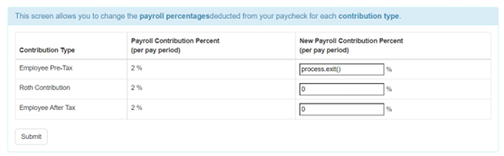

# Raport podatności znalezionych w aplikacji Node Goat

| Testowany system | Node Goat |
|:------: | :-----------: |
| Data wykonania | XII 2022 - I 2023 |
|  Miejsce wykonania audytu    | Kraków |
| Audytorzy wykonujący prace | Aleks Prochal, Michał Serwaczak, Jakub Sosin |
|  Wersja raportu    | 1.0 |

# 1.	Podsumowanie
Audyt aplikacji NodeGoat został zrealizowany w celu ustalenia zgodności ze standardem OWASP TOP 10. 
Stan zgodności aplikacji NodeGoat z OWASP Top 10 można uznać jako zły. W aplikacji znajduje się większość z dziesięciu najpopularniejszych błędów spotykanych w aplikacjach webowych.

# 2.	Zakres i cele
## 2.1 Cel
Celem audytu była wstępna weryfikacja spełniania przez aplikację standardu OWASP TOP 10, jest to dziesięć najpopularniejszych błędów spotykanych w aplikacjach webowych.

## 2.2	Wykonane czynności
W ramach audytu wykonano następujące czynności:
* Analiza błędów występujących w aplikacji
*	Rozmowy z deweloperami

## 2.3	Aplikacja NodeGoat
Aplikacja NodeGoat jest aplikacją webową, opartą o architekturę klient-serwer. Wykorzystuje m. in. Następujące technologie:
* Serwer HTTP
* MongoDB
* NodeJS

# 3. Znalezione podatności pod względem poziomu niebezpieczeństwa

# 4. Znalezione podatności

| $\color{grey}{\textrm{Nie stwierdzono}}$ |$\color{green}{\textrm{Niski}}$| $\color{yellow}{\textrm{Średni}}$ |$\color{red}{\textrm{Wysoki}}$|
|-|-|-|-|

| Numer | Opis |
| :------: | ----------- |
| A01:2021 Broken Access Control| <ul><li>$\color{red}{\textrm{Aplikacja wykorzystuje userid jako część adresu URL}}$</li><li>$\color{red}{\textrm{Możliwość dostępu do zasobów bez posiadania odpowiednich uprawnień}}$</li><li>$\color{yellow}{\textrm{	Istnieje możliwość podmiany linku na taki, który prowadzi w inne miejsce}}$</li></ul> |
| A02:2021 Cryptographic Failures| <ul><li>$\color{red}{\textrm{Aplikacja wykorzystuje protokół HTTP do komunikacji z serwerem.}}$</li><li>$\color{red}{\textrm{Aplikacja przechowuje wrażliwe dane osobiste użytkownika jako zwykły tekst, bez używania jakiegokolwiek szyfrowania.}}$</li>
| A03:2021 Injection| <ul><li>$\color{red}{\textrm{Możliwość wstrzyknięcia kodu JS}}$</li><li>$\color{red}{\textrm{Podatności XSS}}$</li>
| A04:2021 Insecure Design| <ul> <li>$\color{grey}{\textrm{Na razie nie stwierdzono}}$</li>
| A05:2021 Security Misconfiguration| <ul> <li>$\color{red}{\textrm{Domyślny nagłówek HTTP x-powered-by może ujawnić szczegóły implementacji atakującemu}}$</li> <li>$\color{green}{\textrm{Nie jest ustawiona domyślna nazwa sesji cookie}}$</li>
| A06:2021 Vulnerable and Outdated Components| <ul> <li>$\color{yellow}{\textrm{Wykorzystywane są przestarzałe wersje bibliotek, oraz instalowane takie, które nie są używane}}$</li> 
| A07:2021 Identification and Authentication Failures| <ul> <li>$\color{red}{\textrm{Hasło zapisane w bazie danych w postaci zwykłego tekstu}}$</li><li>$\color{yellow}{\textrm{Sesja pozostaje aktywna do momentu, gdy użytkownik jawnie się wyloguje}}$</li><li>$\color{yellow}{\textrm{Aplikacja nie wymusza silnego hasła}}$</li><li>$\color{green}{\textrm{Aplikacja precyzuje czy błędne jest hasło czy login}}$</li>
| A08:2021 Software and Data Integrity Failures| <ul> <li>$\color{grey}{\textrm{ Na razie nie stwierdzono }}$</li>
| A09:2021 Security Logging and Monitoring Failures| <ul> <li>$\color{yellow}{\textrm{Brak jakiegokolwiek logowania i monitoringu}}$</li>
| A10:2021 Server-Side Request Forgery (SSRF)| <ul> <li>$\color{red}{\textrm{Atakujący może zmienić parametry URL żeby wskazać na kontrolowaną przez siebie stronę internetową, aby wejść w interakcję z serwerem }}$</li>

# 5. Szczegóły
## A01:2021 Broken Access Control
Kategoria podatności opisująca błędy dostępu. Kontrola dostępu egzekwuje politykę w taki sposób, aby użytkownicy nie mogli działać poza swoimi zamierzonymi uprawnieniami. Nieprawidłowości prowadzą zazwyczaj do nieuprawnionego ujawnienia informacji, modyfikacji lub zniszczenia wszystkich danych.
|||
|:------: | ----------- |
| Opis podatności | ***Insecure Direct Object References***   Aplikacja NodeGoat używa `userid` jako części adresu `URL`, oraz nie sprawdza czy użytkownik jest uprawniony do przeglądania strony docelowej. Widoczne jest to w module Allocations. Napastnik jest w stanie zmodyfikować adres `URL` i uzyskać informacje o alokacjach innych użytkowników. |
| Zrzuty ekranowe |W `routes/allocations.js`, NodeGoat pobiera `id` użytkownika z adresu url, aby pobrać alokacje.    W pasku przeglądarki widnieje następujący adres `URL`: `http://127.0.0.1:4000/allocations/2`       Wytarczy zmienić adres na przykładowo: `http://127.0.0.1:4000/allocations/3` aby uzyskać nieautoryzowany dostęp do danych innego użytkownika      |
| Poziom niebezpieczeństwa	 | $\color{red}{\textrm{WYSOKI}}$  |
| Rekomendacje	 | <ul><li>Bezpieczniej jest zawsze pobierać alokacje dla zalogowanego użytkownika (używając `req.session.userId`) zamiast pobierać je z adresu url.</li><li>Każde użycie bezpośredniego odwołania do obiektu z niezaufanego źródła musi zawierać sprawdzenie kontroli dostępu, aby zapewnić, że użytkownik jest upoważniony do żądanego obiektu.</li> <li>Nie eksponować kluczy bazy danych, jako części linku</li></ul> |
|||

|||
|:------: | ----------- |
| Opis podatności | ***Missing Function Level Access Control***   W aplikacji NodeGoat w module `Benefits`, zwykły użytkownik może uzyskać dostęp do zasobów przeznaczonych tylko dla Administratora. Dzięki temu może on je zmienić bez posiadania odpiwiednich uprawnień|
| Zrzuty ekranowe |  W aplikacji NodeGoat, luka ta występuje w module `Benefits`, który umożliwia zmianę daty rozpoczęcia wypłaty świadczeń dla pracowników. Link do modułu świadczeń jest widoczny tylko dla Administratora      W Aplikacji NodeGoat nie ma sprawdzania autoryzacji dla tras związanych z benefits w `routes/index.js`      Standardowy użytkownik domyślnie nie posiada dostępu do tego modułu:      Natomiast wystarczy wprowadzić w pasku `URL` adres: `http://127.0.0.1:4000/benefits` co spowoduje bezpośrednie dostanie się do strony Administratora.   |
| Poziom niebezpieczeństwa	 | $\color{red}{\textrm{WYSOKI}}$  |
| Rekomendacje	 | <ul><li>Można to naprawić, dodając middleware do weryfikacji roli użytkownika – sprawdzenia czy użytkownik jest zalogowany jako admin</li></ul> |
|||

## A02:2021 Cryptographic Failures
Podatność ta umożliwia napastnikowi dostęp do wrażliwych danych. Utrata takich danych może spowodować poważne skutki biznesowe i utratę reputacji. Wrażliwe dane zasługują na dodatkową ochronę, taką jak szyfrowanie, a także specjalne środki ostrożności podczas wymiany z przeglądarką. Jeśli napastnik uzyska dostęp do bazy danych aplikacji, może wykraść wrażliwe informacje niezaszyfrowane lub zaszyfrowane słabym algorytmem szyfrowania.
|||
|:------: | ----------- |
| Opis podatności |Aplikacja NodeGoat wykorzystuje protokół HTTP do komunikacji z serwerem. Jest to protokół nieszyfrowany, może on być podatny na przechwycenie danych |
| Zrzuty ekranowe |  W aplikacji NodeGoat wykorzystuje się niezabezpieczone połączenie HTTP     |
| Poziom niebezpieczeństwa	 | $\color{red}{\textrm{WYSOKI}}$  |
| Rekomendacje	 | <ul><li>Należy wykorzystać bezpieczniejszy, zaszyfrowany protokół HTTPS</li></ul> |
|||

|||
|:------: | ----------- |
| Opis podatności |Aplikacja NodeGoat w żaden sposób nie szyfruje danych przechowywanych w bazie danych. Wszystkie hasła przechowywane są w postacii zwykłego tekstu. W przypadku przechwycenia ich przez napastnika, nie miałby on żadnego probllemu z ich wykorzystaniem, ponieważ nie są one w żaden sposób zazyfrowane. |
| Zrzuty ekranowe |  Niezabezpieczone dane użytkownika trzymane są w bazie danych w postaci zwykłego tekstu  |
| Poziom niebezpieczeństwa	 | $\color{red}{\textrm{WYSOKI}}$  |
| Rekomendacje	 | <ul><li>Szyfrować wszystkie dane wrażliwe</li> <li>Do szyfrowania haseł wykorzystać naprzykład protokół Argon2</li></ul> |
|||

## A03:2021 Injection
Kategoria podatności, dzięki którym użytkownicy wstrzykują różnego typu polecenia, co powoduje wykonanie ich po stronie serwera.
|||
|:------: | ----------- |
| Opis podatności | W aplikacji NodeGoat wykorzystywana jest funkcja `eval()` w celu przetwarzania danych wejściowych. Nie występuje jakakolwiek walidacja. Może to zostać wykorzystane przez atakującego do wstrzyknięcia i wykonania złośliwego kodu JavaScript na serwerze. Innym potencjalnym celem atakującego może być odczytanie zawartości plików z serwera. |
| Zrzuty ekranowe |  W `routes/contributions.js`, funkcja `handleContributionsUpdate()` w sposób niezabezpieczony używa `eval()` do konwersji kwot składek podanych przez użytkownika na liczby całkowite.      Atakujący może wyłączyć serwer poprzez wykonanie polecenia: `process.exit()`    Po kliknięciu przycisku `SUBMIT` nastąpiło zabicie procesu, serwer przestał działać     Wpisanie w okienko `while(true)` spowodowałoby całkowite wykorzystanie procesora, serwer nie będzie w stanie przetworzyć żadnych innych przychodzących żądań do czasu zrestartowania serwera  Atakujący może także odczytać zawartość katalogu znajdującego się na serwerze poprzez zastosowanie polecenia: `res.end(require('fs').readdirSync('.').toString())`         |
| Poziom niebezpieczeństwa	 | $\color{red}{\textrm{WYSOKI}}$  |
| Rekomendacje	 | <ul><li>Walidować dane wejściowe po stronie serwera przed przetworzeniem ich</li> <li>Nie używać funkcji `eval()` do przetwarzania danych wejściowych użytkownika. Unikać używania innych poleceń o podobnym działaniu, takich jak `setTimeOut(), setInterval() i Function()`</li> <li>Do parsowania danych wejściowych JSON, zamiast używać `eval()`, użyć bezpieczniejszej alternatywy takiej jak `JSON.parse()`. Do konwersji typów użyć metod parseXXX() związanych z typami.</li></ul> |
|||

|||
|:------: | ----------- |
| Opis podatności | Błędy XSS pojawiają się, gdy aplikacja pobiera niezaufane dane i wysyła je do przeglądarki internetowej bez odpowiedniej walidacji. XSS pozwala atakującym na wykonanie skryptów w przeglądarce ofiary, które mogą uzyskać dostęp do wszelkich ciasteczek, tokenów sesji lub innych wrażliwych informacji przechowywanych przez przeglądarkę, lub przekierować użytkownika na złośliwe strony. |
| Zrzuty ekranowe |  W `routes/contributions.js`, funkcja `handleContributionsUpdate()` w sposób niezabezpieczony używa `eval()` do konwersji kwot składek podanych przez użytkownika na liczby całkowite.      Atakujący może wyłączyć serwer poprzez wykonanie polecenia: `process.exit()`    Po kliknięciu przycisku `SUBMIT` nastąpiło zabicie procesu, serwer przestał działać     Wpisanie w okienko `while(true)` spowodowałoby całkowite wykorzystanie procesora, serwer nie będzie w stanie przetworzyć żadnych innych przychodzących żądań do czasu zrestartowania serwera  Atakujący może także odczytać zawartość katalogu znajdującego się na serwerze poprzez zastosowanie polecenia: `res.end(require('fs').readdirSync('.').toString())`         |
| Poziom niebezpieczeństwa	 | $\color{red}{\textrm{WYSOKI}}$  |
| Rekomendacje	 | <ul><li>Walidować dane wejściowe po stronie serwera przed przetworzeniem ich</li> <li>Nie używać funkcji `eval()` do przetwarzania danych wejściowych użytkownika. Unikać używania innych poleceń o podobnym działaniu, takich jak `setTimeOut(), setInterval() i Function()`</li> <li>Do parsowania danych wejściowych JSON, zamiast używać `eval()`, użyć bezpieczniejszej alternatywy takiej jak `JSON.parse()`. Do konwersji typów użyć metod parseXXX() związanych z typami.</li></ul> |
|||

